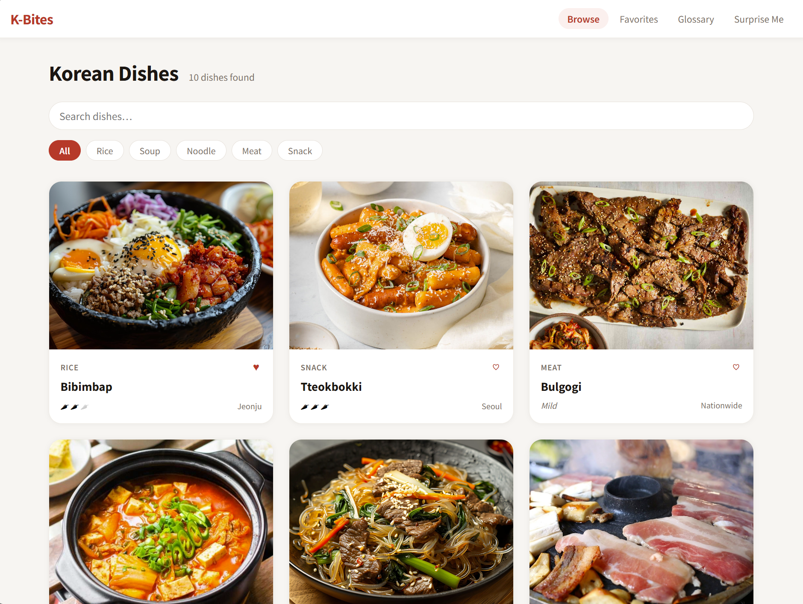
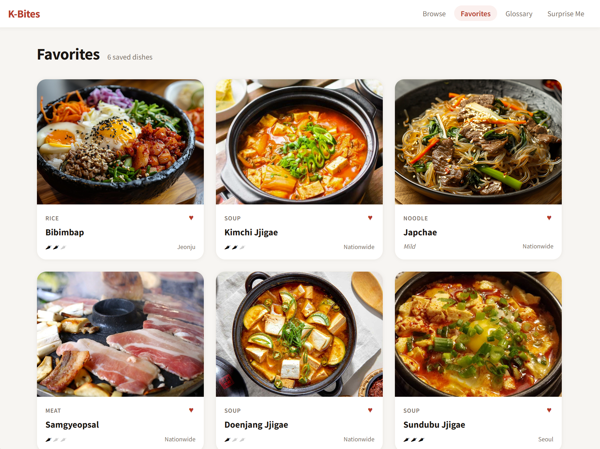

# 🍜 K-Bites

> **Discover Korean cuisine — one dish at a time.**

K-Bites is a Korean food exploration app that helps foodies discover iconic dishes, learn about ingredients, and save their favorites. Built with a clean, modern interface and rich cultural context to make exploring Korean food approachable and fun.

🌐 **[Live Demo → k-bites.netlify.app](https://k-bites.netlify.app/)**

---

## 📸 Screenshots

**Dish Browser**


**Dish Detail**


**Favorites**


---

## ✨ Features

- **Dish Browser** — Browse a curated collection of iconic Korean dishes with photos and short descriptions
- **Dish Details** — Dive deep into each dish: origin, ingredients, cultural notes, and more
- **Favorites System** — Save your favorite dishes and come back to them anytime
- **Ingredient Glossary** — Learn the core ingredients behind Korean cooking
- **Random Dish Generator** — Not sure where to start? Let K-Bites surprise you

---

## 🛠 Tech Stack

| Layer | Technology |
|---|---|
| Framework | React 19 |
| Build Tool | Vite |
| Language | JavaScript (JSX) |
| Font | Noto Sans KR (Google Fonts) |
| Deployment | [Netlify](https://netlify.com) |
| Version Control | Git / GitHub |

---

## 🚀 Getting Started

### Prerequisites
- A modern web browser
- Git (optional, for cloning)

### Run Locally

```bash
# Clone the repository
git clone https://github.com/maxemiliano57/k-bites.git

# Navigate into the project
cd k-bites

# Install dependencies
npm install

# Start the dev server
npm run dev
```

Then open [http://localhost:5173](http://localhost:5173) in your browser.

---

## 📁 Project Structure

```
k-bites/
├── public/             # Static assets
├── src/
│   ├── components/     # React components
│   ├── data/           # Dish and ingredient data (JSON)
│   ├── assets/         # Images and icons
│   ├── App.jsx         # Root component
│   └── main.jsx        # Entry point
├── index.html
├── vite.config.js
├── package.json
└── README.md
```

---

## 🔍 Retrospective

### What went well
- The feature I'm most proud of is the random dish generator — every click surfaces a completely different dish with no repeats. It's one of those small details that makes the app feel polished and fun to use.
- The visual design came together cleanly — the interface feels modern and food-forward
- Implementing the favorites system with localStorage was a satisfying challenge
- Keeping the data structure clean made adding new dishes straightforward

### What I'd do differently
- **Push the UI further** — The current styling is clean and neutral, but for a food app that's a missed opportunity. Food is visual — I'd want people to open K-Bites and immediately feel hungry. That means bolder imagery, richer colors, and a design that makes you want to come back.
- **Expand the Ingredient Glossary** — The glossary is one of my favorite features but it's still pretty thin. I'd add more vocabulary entries and make it feel like a real reference you'd actually use while cooking.
- **Grow the dish library** — The Browse tab needs more content. The more dishes, the more useful and replayable the app becomes — especially with the random dish generator.

---

## 🗺 Roadmap

- [ ] Search and filter by ingredient or region
- [ ] User ratings / reviews
- [ ] Recipe steps (not just ingredients)
- [ ] Dark mode
- [ ] Share-a-dish link generation

---

## 👤 Author

**Max** — [@maxemiliano57](https://github.com/maxemiliano57)

---

## 📄 License

This project is open source and available under the [MIT License](LICENSE).
